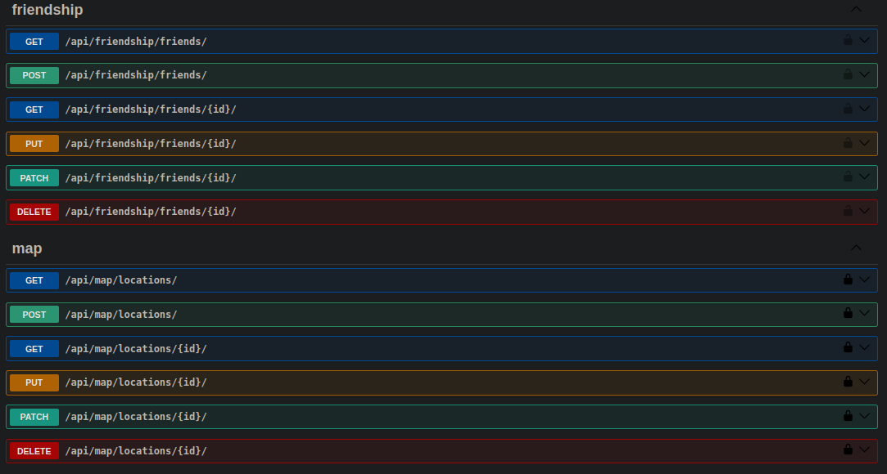
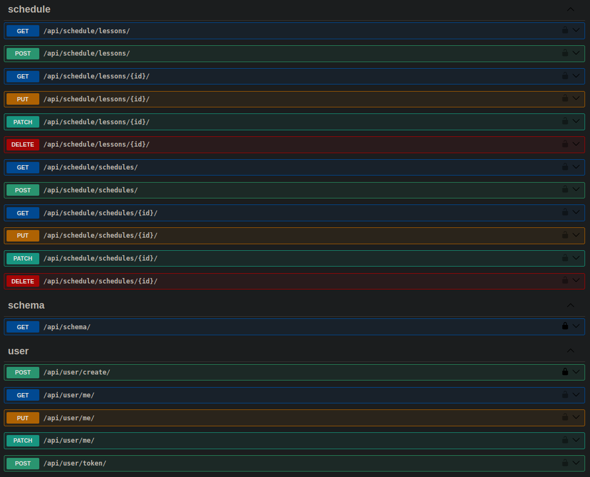

# PŁeasure REST API

## Overview

PŁeasure REST API is the backend service for the PŁeasure application, built using Django. This API facilitates interactions with the PostgreSQL database, which is containerized using Docker for seamless development and deployment.

## Features

- **Django Framework**: Utilizes Django for robust and scalable backend development.
- **RESTful API**: Provides RESTful endpoints for easy integration with front-end applications.
- **PostgreSQL Database**: Uses PostgreSQL for reliable and efficient data management.
- **Docker Integration**: Fully containerized environment using Docker for simplified setup and deployment.

## Technologies

- **Django**: Backend framework
- **Django REST Framework**: Toolkit for building Web APIs
- **PostgreSQL**: Relational database
- **Docker**: Containerization platform

## Setup

### Prerequisites

- Docker
- Docker Compose
- Python 3.x
- pip

### Installation

1. **Clone the repository**:
    ```sh
    git clone https://github.com/your-username/pleasure-rest-api.git
    cd pleasure-rest-api
    ```

2. **Install dependencies**:
    ```sh
    pip install -r requirements.txt
    ```

3. **Setup Docker containers**:
    ```sh
    docker build .
   ```
   ```sh
    docker-compose up 
    ```

4. **Run migrations**:
    ```sh
    docker-compose run --rm app sh -c "python manage.py makemigrations && python manage.py migrate"  
    ```

5. **Create a superuser**:
    ```sh
        docker-compose run --rm app sh -c "python manage.py createsuperuser"
    ```

## API Endpoints

After running the setup, you can access and test the API endpoints 
after creating a superuser at `http://localhost:8000/api/docs`.
Here is a list of the available endpoints:

